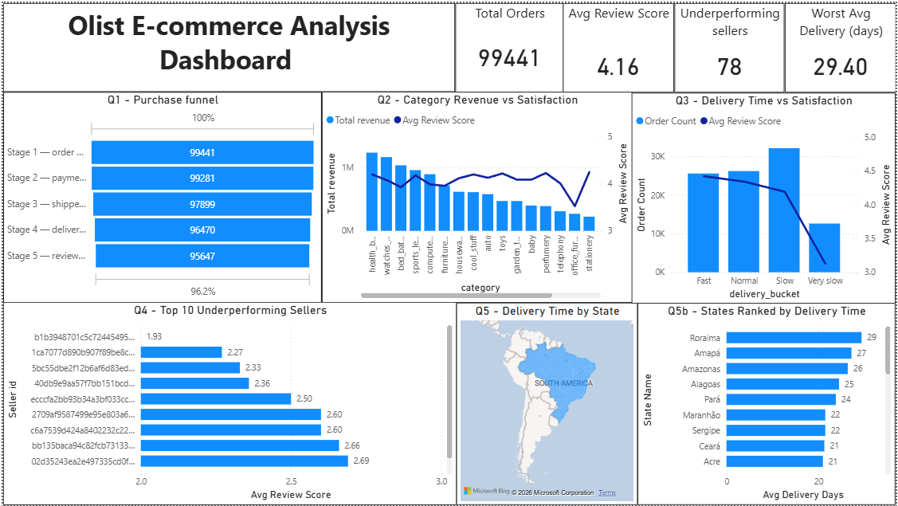

# Olist E-commerce Funnel and Satisfaction Analysis

## Problem statement
Olist is a Brazilian e-commerce marketplace connecting independent 
sellers to customers across Brazil. Despite healthy order volumes, 
a significant portion of customers report low satisfaction scores. 
This analysis investigates which operational factors most strongly 
drive poor customer satisfaction. Specifically it examines delivery 
speed, seller reliability, product category performance, and regional 
logistics as potential drivers of customer dissatisfaction.

## Dataset
Brazilian E-Commerce Public Dataset by Olist, available on Kaggle.
9 relational tables, approximately 100,000 orders from 2016 to 2018.
https://www.kaggle.com/datasets/olistbr/brazilian-ecommerce

## Tools used
PostgreSQL — data storage and analysis  
Excel — visualisation and charts  
Tableau Public — interactive dashboard (link below)  

## Questions answered
Q1 — Where does the Olist purchase funnel break and what are the conversion rates between stages?  
Q2 — Which product categories drive the most revenue and which have the worst satisfaction scores?  
Q3 — Does delivery time affect customer satisfaction scores and at what point do ratings drop significantly?  
Q4 — Which sellers are consistently underperforming and what do they have in common?  
Q5 — Does geography predict poor customer experience and is the problem infrastructure or seller concentration?  

## Methodology
All analysis is filtered to delivered orders only (order_status = 
'delivered') unless explicitly stated otherwise. This ensures 
consistency across all five questions and accurate delivery duration 
measurement. Exploratory queries were run before each analysis to 
validate data distributions and inform analytical decisions such as 
delivery time bucketing thresholds.

## Key findings

**Q1 — Funnel analysis**  
The Olist purchase funnel demonstrates consistently strong conversion 
rates across all five stages, ranging from 98.54% to 99.84%, reflecting 
an operationally healthy marketplace. Volume drop off is not Olist's 
primary challenge. The focus shifts to the quality of the 95,647 reviews 
collected rather than their quantity.
 
**Q2 — Category performance**  
Four of the top 20 revenue generating categories record satisfaction 
scores below 4.0. office_furniture is the most concerning, generating 
R$269,418 while scoring only 3.52, a full 0.67 points below the next 
lowest performer. bed_bath_table presents the highest revenue risk as 
the third largest revenue generator at R$1.04M with a score of only 
3.92. All four underperforming categories involve large, bulky, or 
technically complex items, suggesting delivery handling and transit time 
are primary drivers of dissatisfaction, a hypothesis confirmed in Q3.

**Q3 — Delivery time vs satisfaction**  
Delivery time has a clear and consistent negative impact on customer 
satisfaction. Fast deliveries averaging 4.62 days score 4.42, while 
Very slow deliveries averaging 30.70 days score only 3.13, a drop of 
1.29 points on a 5 point scale. The decline is not linear. Satisfaction 
remains relatively stable up to 20 days but collapses sharply beyond 
that threshold, identifying 20 days as the critical intervention point.

**Q4 — Seller quality**  
78 sellers with a minimum of 10 delivered orders were identified with 
an average review score below 3.5, representing sustained 
underperformance across the seller base. Three distinct underperformer 
profiles emerged: delivery driven sellers with average delivery times 
exceeding 20 days, high volume sellers processing hundreds of orders 
at poor quality such as one seller with 973 orders at 3.35, and non 
delivery underperformers like one São Paulo seller averaging only 8.0 
delivery days yet scoring 2.66, indicating a product or service quality 
issue independent of logistics. São Paulo has the highest concentration 
of underperforming sellers warranting targeted intervention.

**Q5 — Geography**  
Geographic location is a strong predictor of delivery time and 
customer satisfaction. Northern and Northeastern states are 
significantly underserved, with Roraima averaging 29.4 days and 
Alagoas scoring only 3.8. The root cause is seller concentration 
rather than seller quality, 64 to 80% of orders reaching remote 
states are fulfilled by São Paulo based sellers travelling thousands 
of kilometres. States with meaningful local seller presence such as 
Minas Gerais and Paraná at over 13% local share consistently achieve 
delivery times under 12 days, providing a replicable model for 
expansion into underserved regions.

**Overall conclusion**  
Poor customer satisfaction on Olist is not a funnel problem or a 
volume problem. It is a logistics and geographic distribution problem. 
Delivery time is the single strongest driver of dissatisfaction, 
concentrated in remote states that are almost entirely dependent on 
distant São Paulo sellers. The most impactful interventions Olist can 
make are targeted seller recruitment in Northern and Northeastern 
states, logistics support for high volume underperforming sellers, 
and prioritised quality management for furniture and large item 
categories which combine high revenue with below average satisfaction.

## Repository structure
olist-ecommerce-analysis/  
├── README.md  
├── sql/  
│   ├── 01_table_creation.sql  
│   ├── 02_sanity_checks.sql  
│   ├── 03_q1_funnel_analysis.sql  
│   ├── 04_q2_category_analysis.sql  
│   ├── 05_q4_seller_quality.sql  
│   ├── q3_delivery_analysis/  
│   │   ├── q3a_delivery_distribution.sql  
│   │   └── q3b_delivery_vs_satisfaction.sql  
│   ├── q5_geography_analysis/  
│   │   ├── q5a_state_delivery.sql      
│   │   └── q5b_seller_concentration.sql    
├── insights/  
│   ├── q1_funnel_analysis.md  
│   ├── q2_category_performance.md  
│   ├── q3_delivery_vs_satisfaction.md  
│   ├── q4_seller_quality.md  
│   └── q5_geography_analysis.md  
└── assets/  
├── q1_funnel_chart.png  
├── q2_category_chart.png  
├── q3_delivery_chart.png  
├── q4_seller_chart.png  
├── q5a_state_delivery_chart.png  
└── q5b_seller_concentration_chart.png  

## How to run  
1. Create a PostgreSQL database  
2. Run sql/01_table_creation.sql to create all 9 tables  
3. Import the Olist CSVs into each table using COPY or pgAdmin import  
4. Run each query file in the sql/ folder in numerical order  
5. Refer to the insights/ folder for findings and interpretation of each query  

## Tableau dashboard
Built using Power BI. Full dashboard screenshot below.

## Author
Akhilesh Rangaraj   
Transitioning from Aeronautical Engineering to Business and Product Analytics  
LinkedIn: https://www.linkedin.com/in/akhilesh-rangaraj-ba39b126b/
