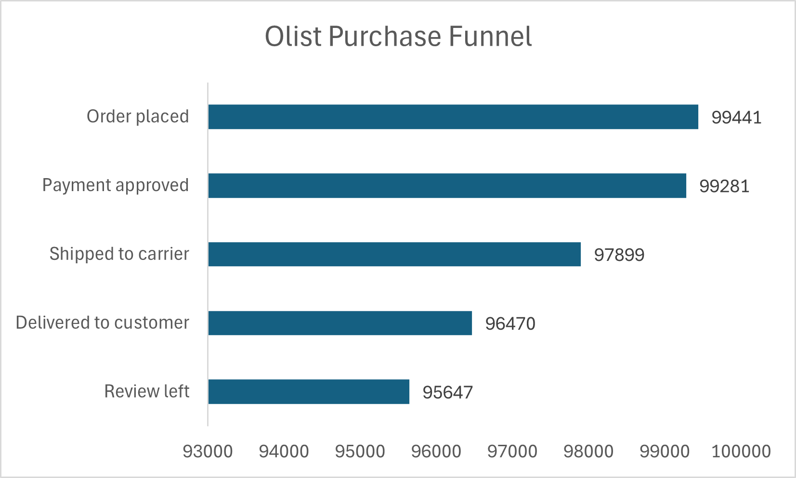

## Problem
Where does the Olist purchase funnel break, and what is the conversion 
rate between each stage from order placement through to customer review?

## Approach
A 5 stage funnel was built using a CTE in PostgreSQL. Orders were counted 
at each stage using conditional filters on status and timestamp columns. 
Conversion rates between stages were calculated using the LAG window 
function, which retrieves the previous row's order count to compute the 
percentage of orders progressing to the next stage. Stage 5 was filtered 
to delivered orders only to maintain consistency across the funnel.

## Output

| Stage | Order count | Conversion rate |
|---|---|---|
| Stage 1 — order placed | 99,441 | — |
| Stage 2 — payment approved | 99,281 | 99.84% |
| Stage 3 — shipped to carrier | 97,899 | 98.61% |
| Stage 4 — delivered to customer | 96,470 | 98.54% |
| Stage 5 — review left | 95,647 | 99.15% |

## Findings
The Olist purchase funnel demonstrates consistently strong conversion 
rates across all five stages, reflecting an operationally healthy 
marketplace.

**Operational performance is strong** — conversion rates across the first 
four stages range from 98.54% to 99.84%, indicating that payment 
processing, carrier handoff, and last mile delivery are all functioning 
with minimal drop-off. No single operational stage presents a meaningful 
bottleneck.

**Post purchase engagement is surprisingly high** — 99.15% of delivered 
customers left a review, which is exceptionally high for an e-commerce 
platform. This indicates strong customer engagement and provides a 
reliable satisfaction signal across nearly the entire delivered order base.

**The primary challenge is not funnel drop-off** — with 95,647 reviews 
collected from delivered orders, volume loss is not Olist's core problem. 
The more critical question shifts to the quality of those reviews rather 
than their quantity. A platform where almost every customer completes the 
journey and leaves feedback is well positioned to act on satisfaction 
data, provided the scores are strong. This shifts the focus of the 
analysis toward satisfaction score drivers, which are investigated through 
product category performance in Q2, delivery time impact in Q3, seller 
quality in Q4, and regional logistics in Q5.

## Chart

## Data note
Stage 5 was filtered to delivered orders only (order_status = 
'delivered') to maintain funnel consistency across all stages. Reviews 
on non-delivered orders — including shipped, invoiced, and cancelled 
statuses — were excluded from the funnel but retained in the raw data 
for seller quality analysis in Q4. An anomaly was identified during 
analysis where the initial Stage 5 count exceeded Stage 4, caused by 
reviews existing on non-delivered orders. This was resolved by applying 
the delivered filter, ensuring the funnel reflects a logically consistent 
customer journey.
