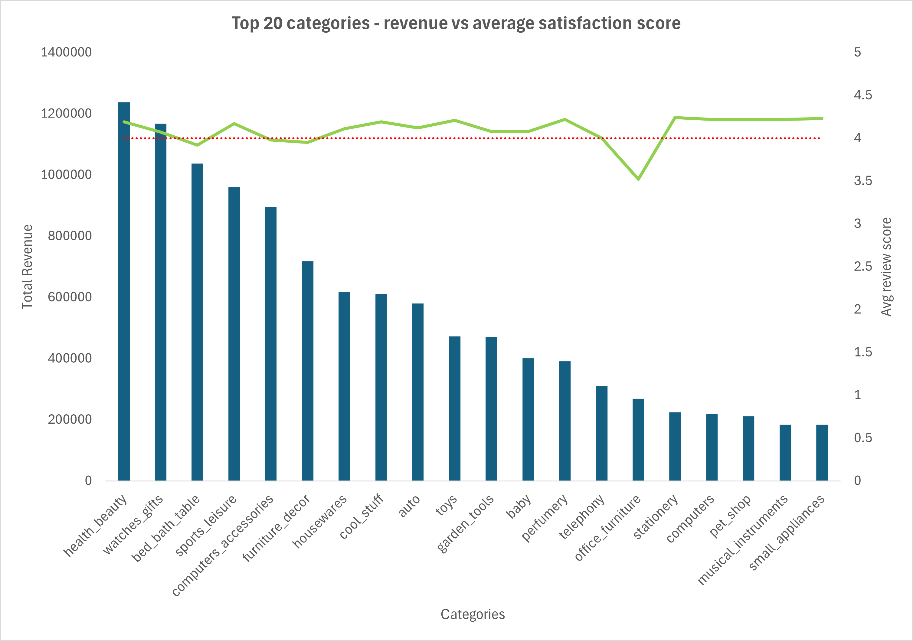

Problem: Which product categories drives the most revenue and which ones have the worst satisfaction scores. 

Approach: Cretaed a query that ranks the top 20 revenue generating product categories and their respectinve average customer satisfaction rating.

Findings: Among the top 20 revenue generating categories, four recorded average satisfaction scores below 4.0: office_furniture (3.52), bed_bath_table (3.92), furniture_decor (3.95), and computers_accessories (3.98). Notably office_furniture has the lowest satisfaction score in the entire top 20 by a significant margin. The highest revenue category, health_beauty at R$1.23M, maintains a healthy rating of 4.19. All four underperforming categories share a common characteristic as they are large or bulky items, suggesting delivery handling may be a contributing factor. This hypothesis will be tested in Q3 through delivery time vs satisfaction analysis.

Data note: 610 products with no category name (1.85% of total products) and 13 products across 2 untranslated categories (pc_gamer and portateis_cozinha_e_preparacao_de_alimentos) were excluded via INNER JOIN on the translation table. Combined exclusion rate is under 2% and does not materially affect findings. Analysis is filtered to delivered orders only, consistent with project methodology.
