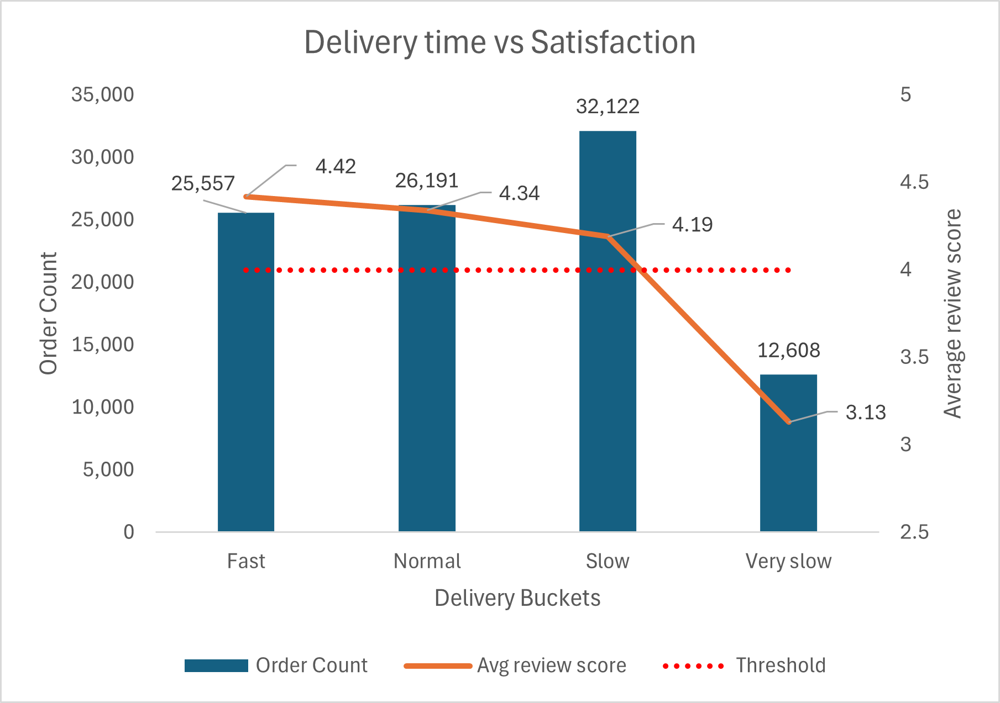

## Problem
Does delivery time affect customer satisfaction scores, and if so, 
at what point does a longer delivery duration cause ratings to drop 
significantly?

## Approach
Before bucketing, a percentile distribution query was run to determine 
data driven thresholds. The analysis revealed P25 at 6 days, median at 
10 days, P75 at 15 days, and P90 at 23 days. Buckets were set at these 
natural breakpoints rather than arbitrary thresholds, ensuring each 
bucket represents a meaningful segment of the customer base. A CTE was 
used to first calculate delivery duration per order and assign each order 
to a bucket, followed by an aggregation query to calculate the average 
review score and order count per bucket.

## Output

| Delivery bucket | Order count | Avg review score | Avg delivery days |
|---|---|---|---|
| Fast | 25,557 | 4.42 | 4.62 |
| Normal | 26,191 | 4.34 | 8.76 |
| Slow | 32,122 | 4.19 | 14.85 |
| Very slow | 12,608 | 3.13 | 30.70 |

## Findings
Delivery time has a clear and consistent negative impact on customer 
satisfaction across all four buckets. Fast deliveries averaging 4.62 
days score 4.42, while Very slow deliveries averaging 30.70 days score 
only 3.13, a drop of 1.29 points on a 5 point scale.

Three distinct delivery performance profiles emerged from the data:

**Fast and Normal deliveries** — orders delivered within 10 days maintain 
strong satisfaction scores of 4.42 and 4.34 respectively, suggesting 
customers are largely satisfied when expectations are met within a 
reasonable timeframe.

**Slow deliveries** — orders taking between 11 and 20 days show a gradual 
decline to 4.19, indicating growing dissatisfaction but still within an 
acceptable range for most customers.

**Very slow deliveries** — orders exceeding 20 days collapse sharply to 
3.13, a 1.06 point drop from the Slow bucket alone. This non linear 
decline identifies 20 days as the critical threshold beyond which customer 
experience deteriorates significantly. 12,608 orders fall into this 
category, representing a material volume of dissatisfied customers.

This finding directly supports the Q2 observation that furniture and 
large item categories, which likely experience longer delivery times due 
to size and handling complexity, consistently underperform on satisfaction 
scores. It also provides the mechanism behind Q4 underperforming sellers 
where delivery driven poor performers cluster around delivery times 
exceeding 20 days.

## Chart

## Data note
The analysis was restricted to delivered orders only (order_status = 
'delivered') to ensure accurate delivery duration measurement. Incomplete 
or cancelled orders do not have a definitive delivery timestamp and would 
produce misleading bucket assignments. A LEFT JOIN was applied on 
order_reviews to retain all delivered orders in the order count regardless 
of whether a review was left. AVG() inherently ignores NULL review scores, 
ensuring satisfaction averages reflect only orders with valid customer 
feedback.
