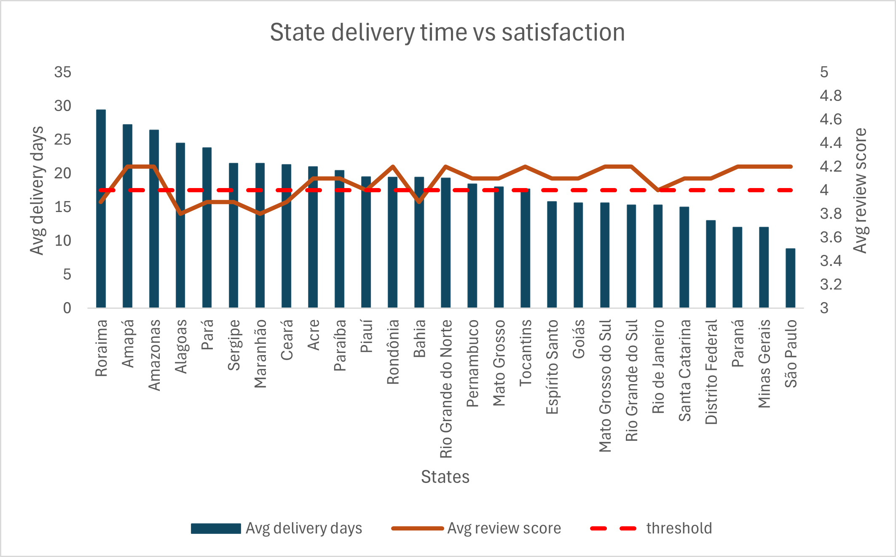
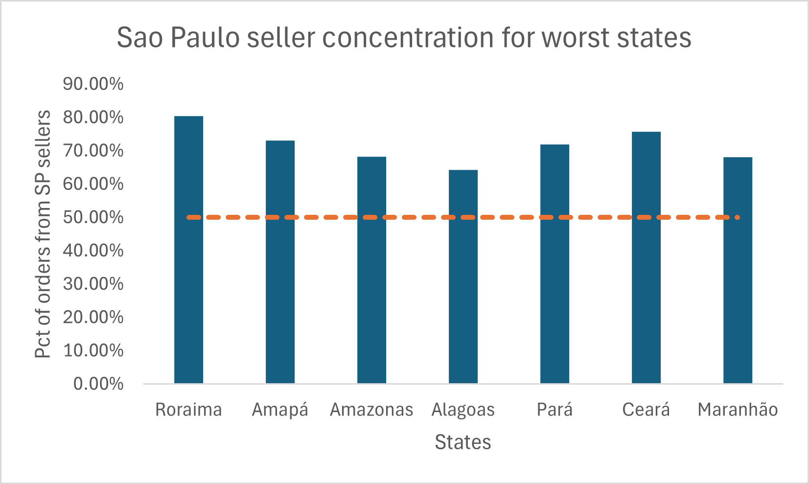

## Problem
Does geography predict poor customer experience on the Olist platform, 
and is the root cause a logistics infrastructure gap or a seller 
quality issue?

## Approach
Two queries were used to answer this question from different angles.

Q5a used a CTE to calculate delivery duration per order by joining 
customers, orders, and order_reviews. The outer query aggregated results 
at state level, producing average delivery days and average review score 
per Brazilian state, ordered by delivery time to surface the worst 
performing states immediately.

Q5b used a window function with PARTITION BY customer_state to calculate 
the percentage share of orders fulfilled by sellers from each state, 
for every customer state. This reveals whether customers in remote states 
are predominantly served by local sellers or by distant São Paulo based 
sellers.

## Output

**Q5a — State level delivery time and satisfaction**

| Customer state | Total orders | Avg review score | Avg delivery days |
|---|---|---|---|
| RR — Roraima | 41 | 3.9 | 29.4 |
| AP — Amapá | 67 | 4.2 | 27.2 |
| AM — Amazonas | 145 | 4.2 | 26.4 |
| AL — Alagoas | 397 | 3.8 | 24.5 |
| PA — Pará | 946 | 3.9 | 23.8 |
| SE — Sergipe | 335 | 3.9 | 21.5 |
| MA — Maranhão | 717 | 3.8 | 21.5 |
| CE — Ceará | 1279 | 3.9 | 21.3 |
| AC — Acre | 80 | 4.1 | 21.0 |
| PB — Paraíba | 517 | 4.1 | 20.4 |
| PI — Piauí | 476 | 4.0 | 19.5 |
| RO — Rondônia | 243 | 4.2 | 19.4 |
| BA — Bahia | 3256 | 3.9 | 19.4 |
| RN — Rio Grande do Norte | 474 | 4.2 | 19.3 |
| PE — Pernambuco | 1593 | 4.1 | 18.4 |
| MT — Mato Grosso | 886 | 4.1 | 18.0 |
| TO — Tocantins | 274 | 4.2 | 17.7 |
| ES — Espírito Santo | 1995 | 4.1 | 15.8 |
| GO — Goiás | 1957 | 4.1 | 15.6 |
| MS — Mato Grosso do Sul | 701 | 4.2 | 15.6 |
| RS — Rio Grande do Sul | 5345 | 4.2 | 15.3 |
| RJ — Rio de Janeiro | 12350 | 4.0 | 15.3 |
| SC — Santa Catarina | 3546 | 4.1 | 15.0 |
| DF — Distrito Federal | 2080 | 4.1 | 13.0 |
| PR — Paraná | 4923 | 4.2 | 12.0 |
| MG — Minas Gerais | 11354 | 4.2 | 12.0 |
| SP — São Paulo | 40501 | 4.2 | 8.8 |

**Q5b — Seller concentration for worst performing states (SP share)**

| Customer state | SP seller share | Avg delivery days |
|---|---|---|
| RR — Roraima | 80.5% | 29.4 |
| AP — Amapá | 73.1% | 27.2 |
| AM — Amazonas | 68.3% | 26.4 |
| CE — Ceará | 75.7% | 21.3 |
| AL — Alagoas | 64.3% | 24.5 |
| PA — Pará | 71.9% | 23.8 |
| SP — São Paulo | 75.7% | 8.8 |

## Findings
Geographic location is a strong predictor of delivery time on the Olist 
platform, and delivery time in turn drives customer satisfaction as 
established in Q3.

**Northern and Northeastern states are significantly underserved.**
The five worst performing states by delivery time are all located in 
Northern or Northeastern Brazil — Roraima (29.4 days, 3.9 score), 
Amapá (27.2 days, 4.2), Amazonas (26.4 days, 4.2), Alagoas (24.5 days, 
3.8), and Pará (23.8 days, 3.9). These states receive orders 2 to 3 
times slower than São Paulo customers who average only 8.8 days.

**The root cause is seller concentration, not seller quality.**
Q5b reveals that 68 to 80% of orders reaching Northern states are 
fulfilled by São Paulo based sellers, requiring goods to travel thousands 
of kilometres to reach customers. This is a structural infrastructure 
problem, not a seller performance issue. The same São Paulo sellers 
delivering in 8.8 days locally are delivering in 26 to 29 days to 
remote states simply due to distance.

**Local seller presence directly improves delivery performance.**
States with meaningful local seller bases consistently achieve better 
delivery times. MG and PR both have over 13% local seller share and 
achieve 12.0 day delivery times. SC at 7.2% local share achieves 15.0 
days. RJ at 7.7% local share achieves 15.3 days. The correlation is 
clear — every percentage point increase in local seller share reduces 
average delivery time.

**An important nuance on satisfaction scores.**
Customers in the most remote states — AM, AP, RO — score between 4.1 
and 4.2 despite extremely long delivery times, suggesting they may have 
adjusted expectations. The most concerning states are those with both 
long delivery times AND low scores — AL (3.8), MA (3.8), BA (3.9), 
CE (3.9), SE (3.9) — indicating unmet expectations rather than 
acceptance of poor service.

**RJ stands out as an anomaly.**
Despite being a major metropolitan area with 15.3 day average delivery, 
Rio de Janeiro scores only 4.0 — lower than many states with comparable 
or longer delivery times. This suggests factors beyond delivery time 
affect satisfaction in RJ and warrants further investigation.

**Recommendation.**
Olist should prioritise seller recruitment in Northern and Northeastern 
states, particularly AM, AP, RR, PA, AL, MA, and CE. A targeted seller 
onboarding program in these regions would directly reduce delivery times 
and improve customer satisfaction in Olist's most underserved markets. 
The success of MG and PR as local seller hubs provides a replicable 
model for this expansion strategy.

## Data note
Analysis was restricted to delivered orders only (order_status = 
'delivered') for consistency with project methodology. Q5b does not 
include order_reviews as the purpose is to analyse seller geographic 
distribution rather than satisfaction scores, which are covered in Q5a. 
State abbreviations are standard Brazilian state codes. Full state names 
are provided in the output table for readability.

## Charts

